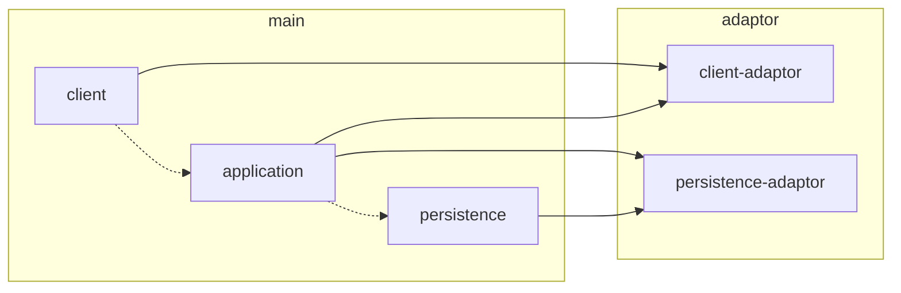
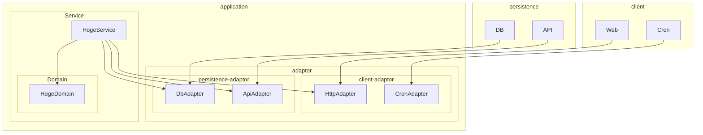

# tech-summary-bot.ts

## Install

```bash
npm ci
```

## Prepare

```bash
cp .env.sample .env
```

Update `.env` file.

- `DISCORD_WEBHOOK_URL`
  - https://support.discord.com/hc/ja/articles/228383668-%E3%82%BF%E3%82%A4%E3%83%88%E3%83%AB-Webhooks%E3%81%B8%E3%81%AE%E5%BA%8F%E7%AB%A0
- `DISCORD_TOKEN`
- `DISCORD_GUILD_ID`
- `OPEN_AI_API_KEY`
  - https://platform.openai.com/account/api-keys

## Run

### Local

```bash
npm run exec
```

### Build

```bash
npm run build
node ./dist/index.js
```

## Lint/Format

```bash
npm run lint
```

```bash
npm run lint:fix
```

## Architecture



