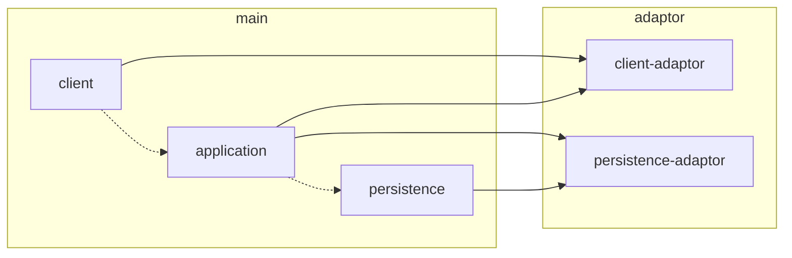
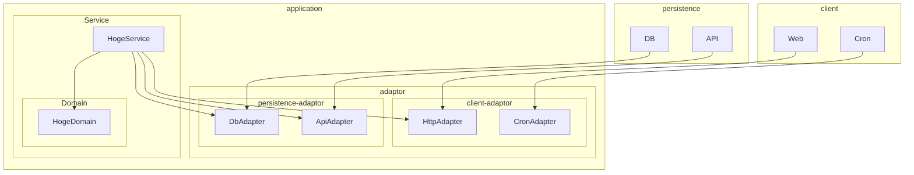

[](https://app.netlify.com/sites/wondrous-cobbler-e90c6c/deploys)

# netlify-functions-template.ts

## Install

```bash
npm ci
```

## Dev

```bash
npm run dev
```

```bash
$ curl http://localhost:8888/netlify/functions/hello.

{"message":"Hello World"}
```

## Deploy

Just execute `git push`.

## Execute

```bash
$ curl https://{site_name}.netlify.app/.netlify/functions/hello

{"message":"Hello World"}
```

## Architecture



